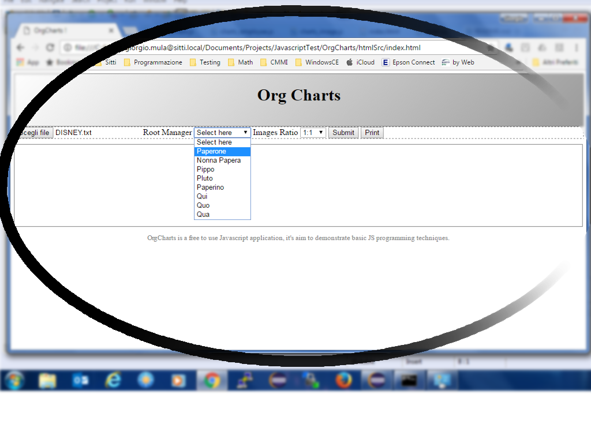
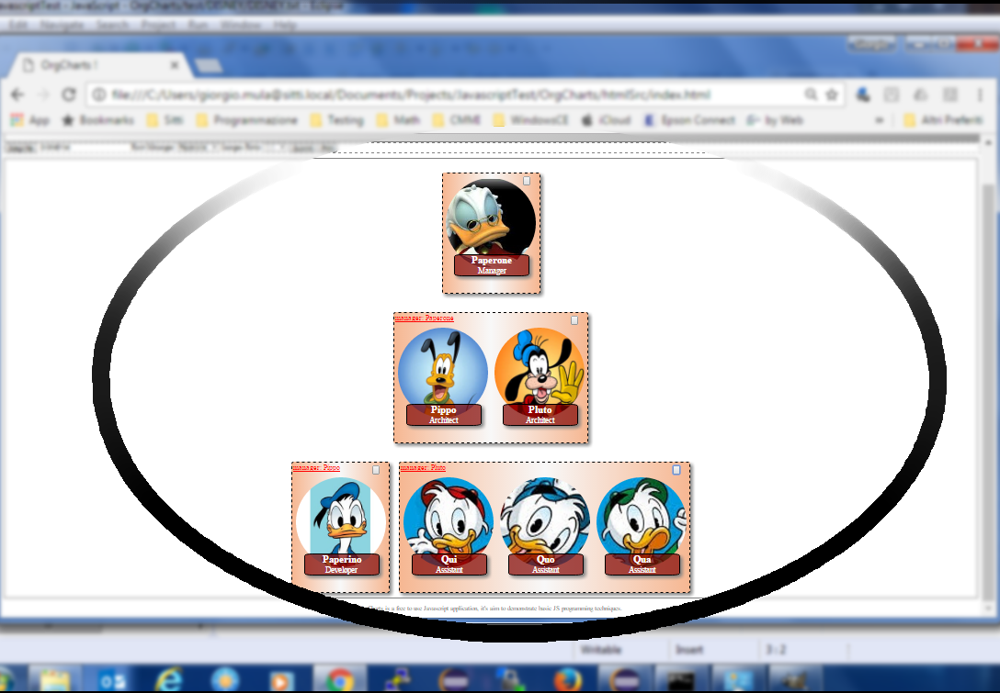

# org-charts

Org-charts is a stand-alone browser application to generate cool organization charts. User select a .csv file with employees name and relations and, of course, related images names to render an html page to open in your favorite browser.
Can also select a middle-manager employee and just print details about his own branch.

<h2>Some screenshots</h2>

<h2>For developers</h2>

<u>Project development details</u>: used Eclipse with JDT plugin. Just open related .project file and enjoy
More details into doxy generated document at <a href="docs/html/index.html">Doxy docs</a>

